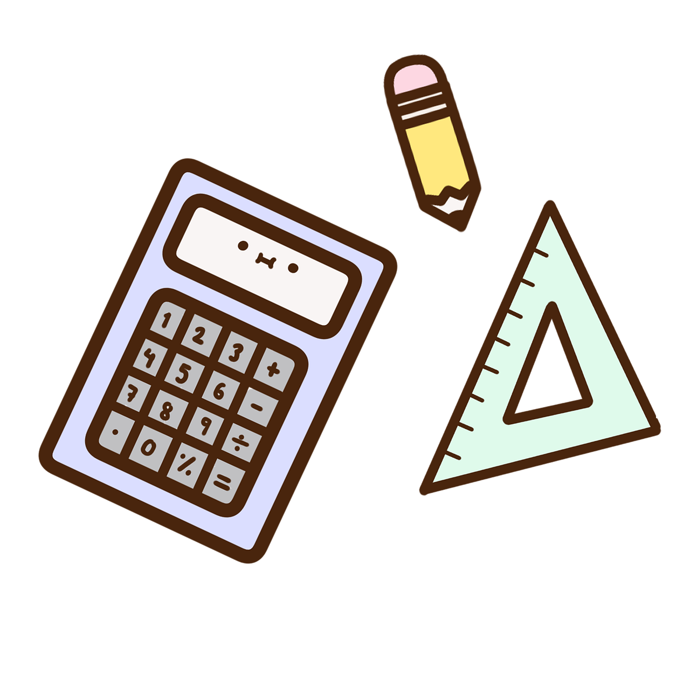
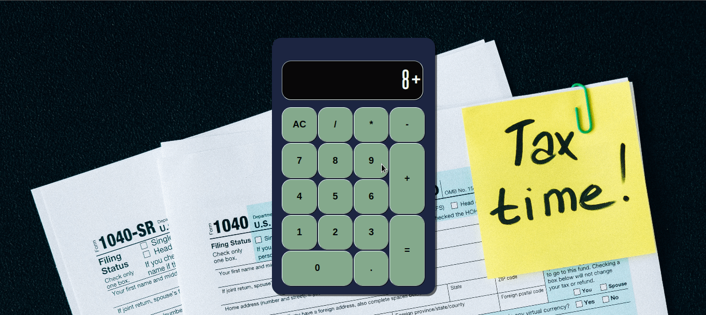

    

<h1>Projeto Calculadora</h1>

Este projeto foi desenvolvido com HTML5, CSS3 e JavaScript para estudos de manipulação do DOM, onde é possivel realizar cálculos de adição, subtração, divisão e multiplicação.

    

   Confira <a href="https://mendjoy.github.io/projeto-calculdadora-js/">aqui</a>

 